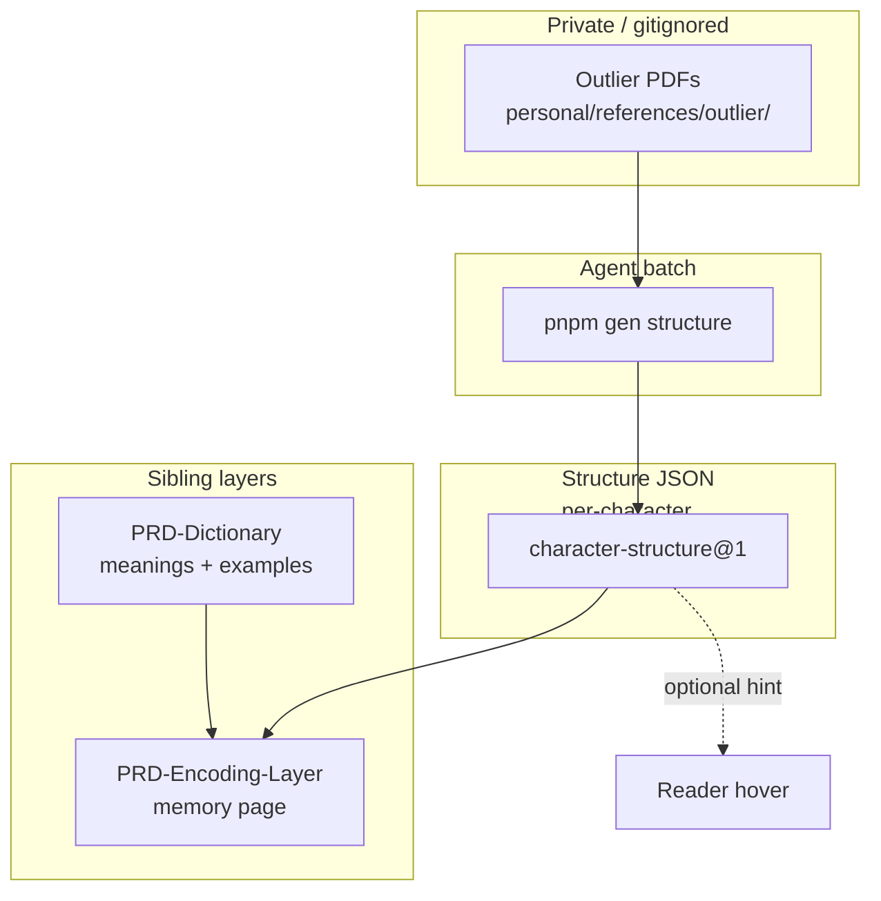

# PRD — Tsumugu Character Structure Layer

**A per-character structural dictionary keyed on the Outlier Linguistics *Functional Component Framework* — form, meaning, sound, and empty components — stored as structured, batch-authored JSON the app consumes offline. Private Outlier PDFs live in `personal/references/outlier/` as a non-redistributed agent reference; generated entries are authored into Tsumugu's own schema, grounded and cited, never paraphrased into the public engine or wiki. The layer feeds the Encoding PRD's character story with `grounding: "sourced"` instead of folk decomposition, and optionally surfaces a compact "why it looks like this" line in hover for single-character headwords.**

> **Sibling split.** [[PRD-Dictionary]] owns *what a word means* (English gloss, leveled monolingual definition, example sentences). [[PRD-Encoding-Layer]] owns the *memory page* (mnemonic, why-tricky, related, FSRS rail). **This PRD owns *why a character looks like this and how it works in the system*** — functional components, form explanations, meaning trees, and sound/meaning neighbour links — at **per-character** granularity, assembled into multi-character words at consumption time.

---

## 0. Decision log

- **✅ Outlier-informed, not Outlier-redistributed.** The methodology (Functional Component Framework: form / meaning / sound / empty) is public pedagogy from Outlier Linguistics blog posts and courses. The **commercial dictionary text and PDFs are copyrighted** — they stay in `personal/references/outlier/` (gitignored), used only as a **private, non-redistributed reference** during agent batch runs. Generated JSON is **structured data authored for Tsumugu** (component types, glosses in our voice, links we maintain), not a dump or paraphrase of Outlier entry prose. Same legal posture as MoEDict BY-ND in [[PRD-Dictionary]] §7: reference yes, derive-for-redistribution no.
- **✅ Per-character store, per-word assembly.** Outlier (and Chinese orthography) are character-centric. Tsumugu headwords are often multi-character (`熱鬧`, `夜市`). We store `CharacterStructureEntry` keyed by **single NFC character**; word-level views **assemble** char entries left-to-right. Single-char headwords resolve directly.
- **✅ Essentials-first, Expert-deferred.** v1 ships the Outlier "Essentials" shape: form explanation, component analyses (typed), meaning tree (original → modern senses), system neighbours (by component). Expert-only fields (full evolution timeline, earliest oracle/bronze forms gallery) are optional `expert?:` blocks, filled when the PDF reference is available and the agent confirms grounding.
- **✅ Grounding is mandatory.** Every form explanation and component role carries `grounding: "sourced" | "mnemonic-device" | "speculative"` + optional `source` citation. Entries traced to Outlier reference material cite `source: "outlier-essentials"` or `"outlier-expert"` **without reproducing their prose**. Un-cited structural claims default to `mnemonic-device` and render with the Encoding PRD's visible marker.
- **✅ Consumption split.** **Encoding page** gets the full structured story (replacing folk `Etymology.parts` decomposition). **Reader hover** may show a one-line `structureHint` for single-char words only (optional, collapsed). **Dictionary definitions** are untouched — this layer does not replace `definitions.en` / `definitions.zh`.
- **✅ Precedence:** `custom > generated > reference-seed` per field, same spirit as `custom > prebaked > dict`. User corrections in the vault win.
- **✅ Batch only, offline consume.** Agent runs `pnpm gen structure` (new); app reads JSON via vault / pack path. No API in the loop.
- **✅ Private folder location:** `tsumugu/personal/references/outlier/` — **not** `tsumugu-wiki` (public Quartz site). Wiki encoding twins **consume** generated structure data; they do not host the PDFs.

---

## 1. Problem

Tsumugu's encoding layer already promises a "character story," but today's pipeline produces **folk decomposition** — e.g. `鬧` explained as `鬥 + 市` (fight + market), which Outlier classifies as a **corrupted-component misread**, not a functional analysis. The Encoding PRD correctly flags this and re-grades it `grounding: "mnemonic-device"`, but that leaves you without a **reliable, systematic** structural dictionary.

Gaps:

1. **No functional-component model.** `Etymology.parts` (`types.ts`) is a flat `{ char, reading, gloss, note }[]` with no component **type** (form / meaning / sound / empty), no corruption flag, no sound-series links.
2. **No per-character canon.** Multi-character words need per-char expertise assembled consistently; radicals-table thinking ("this part means X") actively misleads (Outlier's core critique).
3. **No system-level links.** Predictive ability — knowing that `戠` is the sound component in `識` and links to `職`, `織`, `幟` — is absent.
4. **No private home for purchased reference material.** You have (or will place) Outlier Essentials/Expert PDFs with no folder convention or generation firewall.

The Outlier Dictionary of Chinese Characters is the best off-the-shelf articulation of how characters **actually** work for learners. This PRD turns that pedagogy into a **Tsumugu-native data layer** you control, correct, and render offline — without contaminating open-core hygiene or publishing copyrighted text.

---

## 2. Goals & success criteria

1. **Private reference storage.** PDFs placed under `personal/references/outlier/pdfs/` are gitignored and never referenced by the public engine build. *Check: `git check-ignore -v personal/references/outlier/pdfs/*` succeeds; no PDF paths in `packages/` or `apps/`.*
2. **Per-character schema.** Every covered character has a `character-structure@1` JSON with form explanation, ≥1 component analysis (typed), and meaning tree root. *Check: fixture for `鬧` lists component types; does **not** claim `鬥+市` as meaning-bearing unless sourced and typed.*
3. **Word assembly.** Given headword `熱鬧`, the resolver returns ordered `[熱, 鬧]` entries plus a composed `wordFormSummary`. *Check: `resolveStructure("熱鬧")` returns two char entries and a joined summary string.*
4. **Encoding integration.** `encoding-page@1` etymology is populated from structure data when present; `grounding: "sourced"` when `source` cites outlier reference; folk fallback only when structure is missing. *Check: generated 熱鬧 encoding uses structure-backed story; linter passes grounding rules.*
5. **User correction.** `WordEntry.custom` or per-char `custom.json` overrides component type or form explanation; wins per field. *Check: custom override on `鬧` replaces generated component note in render.*
6. **Open-core hygiene.** Public engine carries **types + resolver only**; all structure JSON and PDFs stay in `personal/` or `packs/private/`. *Check: engine repo has zero structure data files.*

---

## 3. Scope

### In scope (v1)

- Folder convention + README for Outlier PDFs in `personal/references/outlier/`
- `CharacterStructureEntry` schema (`character-structure@1`)
- Per-character JSON store: `packs/private/zh-hant/data/structure/` (or vault mirror)
- `pnpm gen structure` batch command + agent prompt
- Resolver: char → entry; word → assembled view
- Encoding PRD consumption hook (structure → `Etymology` / dedicated `StructureSection`)
- Grounding + corruption flags
- Essentials-tier fields: form explanation, component analyses, meaning tree, system neighbours

### Out of scope (v1)

- Redistributing Outlier text, images, or PDFs
- Publishing raw structure JSON to the public wiki (encoding *prose* twin is fine; license TBD per entry)
- Japanese kanji pack (methodology transfers; data does not)
- vi structural layer (deferred; Hán-Việt etymon links stay in bridge PRD)
- Live Pleco/Outlier API integration
- Automated PDF OCR pipeline (v1: agent reads PDFs you place manually)

### Owned by siblings (do not duplicate)

| Concern | Owner |
|---|---|
| English + 簡明中文 definitions, examples | [[PRD-Dictionary]] |
| Mnemonic devices, why-tricky, related, FSRS page chrome | [[PRD-Encoding-Layer]] |
| Hán-Việt bridge | Main PRD §5.6 |

---

## 4. Users & use cases

**Primary: Wedge** — intermediate zh-Hant; owns Outlier Essentials/Expert PDFs; wants predictive ability and long-term recall without folk radicals.

1. **Place PDFs once.** Copy Outlier Essentials (and optionally Expert) exports into `personal/references/outlier/pdfs/`. Agent never commits them.
2. **Batch structure for SRS words.** `pnpm gen structure --words 熱鬧,識,取 --lang zh-Hant` → agent reads PDF reference → writes per-char JSON → `gen verify` checks grounding tags present.
3. **Review → encoding.** Click due word → encoding page character story shows functional components (sound vs meaning vs form), corruption notes, and system neighbours — sourced, not folk.
4. **Correct a misanalysis.** Override a component type in vault custom layer; persists and wins.
5. **Hover peek (optional).** Single-char unknown word shows `structureHint: "phono-semantic; sound: 戠 shí"` under the definition card.

---

## 5. Core design

### 5.1 Functional Component Framework (the pedagogical core)

Four component **roles** (a component's role is per-character, not intrinsic — `力` is form in `男`, meaning in `努`, sound in `历`, empty in `边`):

| Type | Role | Learner-facing question |
|---|---|---|
| `form` | Meaning via pictographic depiction | "What picture is this part?" |
| `meaning` | Meaning via acquired sense (not depiction) | "What idea does this part contribute?" |
| `sound` | Phonetic component | "What sound hint does this part give?" |
| `empty` | Neither sound nor meaning (corrupted, placeholder, or purely graphic) | "This part is not doing semantic/phonetic work." |

**Corruption** is explicit: `isCorrupted: true` on a component that looks like X but is a corrupted form of Y (Outlier Aspect #3). Prevents false stories like `出 = two mountains`.

### 5.2 Data model (engine types — public, data-free)

```ts
/** Component role in one character (Character Structure PRD §5.1). */
export type ComponentRole = "form" | "meaning" | "sound" | "empty";

export interface ComponentAnalysis {
  /** The component glyph as it appears in this character. */
  glyph: string;
  role: ComponentRole;
  /** Learner-facing one-liner: what this component is doing HERE. */
  function: string;
  /** Original / acquired meaning label, if applicable. */
  meaningLabel?: string;
  /** Sound hint reading (e.g. "shí" for 戠 in 識). */
  soundHint?: string;
  /** True when the modern glyph is a corruption of an earlier form. */
  isCorrupted?: boolean;
  /** When corrupted: brief note, e.g. "foot → 止, not 山+山". */
  corruptionNote?: string;
  grounding: "sourced" | "mnemonic-device" | "speculative";
  source?: string;           // e.g. "outlier-essentials", "qiu-xigui", "user"
  confidence?: number;       // 0..1
}

export interface MeaningNode {
  sense: string;
  /** Modern Mandarin sense vs original invention sense. */
  kind: "original" | "extended" | "modern";
  children?: MeaningNode[];
}

export interface SystemLink {
  /** Linked character sharing a component. */
  char: string;
  relation: "same-sound-component" | "same-meaning-component" | "same-form-component" | "radical-category";
  note?: string;
}

export interface CharacterStructureEntry {
  schema: "tsumugu/character-structure@1";
  char: string;              // single NFC character (key)
  reading?: string;          // primary Mandarin reading when relevant
  /** Character-level: why it looks like this. */
  formExplanation: string;
  components: ComponentAnalysis[];
  meaningTree: MeaningNode;
  systemLinks?: SystemLink[];
  /** Expert-tier optional block (evolution, ancient forms) — omitted in Essentials-only pass. */
  expert?: {
    evolution?: string;
    ancientFormNote?: string;
    // image refs stay vault-local; never bundle in public engine
  };
  grounding: "sourced" | "mnemonic-device" | "speculative";
  source?: string;
  updatedAt?: string;        // ISO date
}

/** Assembled view for a multi-character headword. */
export interface WordStructureView {
  term: string;
  chars: CharacterStructureEntry[];
  /** One-line composed summary for hover. */
  wordFormSummary?: string;
}
```

### 5.3 Private reference storage

```
personal/references/outlier/
├── README.md                 # what goes here, legal posture, how gen uses it
├── pdfs/                     # YOU place purchased PDFs here (gitignored)
│   ├── essentials/           # Outlier Essentials exports (by char or range)
│   └── expert/               # Expert-tier addenda (optional)
└── index.json                # optional: char → pdf file + page mapping (agent-maintained)
```

**Not in tsumugu-wiki.** The wiki is a public publish surface. PDFs never land there. Published encoding pages may *render* structure facts without reproducing Outlier prose.

**`index.json` (optional v1).** Simple map `{ "鬧": { "file": "pdfs/essentials/...", "page": 42 } }` so agents don't re-search PDFs. Maintained by hand or semi-automated; lives gitignored.

### 5.4 Generation pipeline (batch)

1. **`gen structure --chars 鬧,熱` or `--words 熱鬧`** — expands words to NFC chars, dedupes.
2. **Preflight** — for each char, check local `structure/鬧.json` and `index.json` for PDF pointer.
3. **Agent prompt** (`scripts/gen/prompts/character-structure.md`) — instructs:
   - Read the private PDF reference for the char (path from `index.json` or user hint).
   - Output **only** the JSON schema fields; do not paste Outlier paragraphs.
   - Tag each component with `role` per Functional Component Framework.
   - Mark corruption explicitly when the reference does.
   - Set `grounding: "sourced"` + `source: "outlier-essentials"` when derived from reference; `mnemonic-device` when compressing for memory.
   - **Firewall:** no Outlier prose in shared/public artifacts; no PDF bytes in engine repo.
4. **`gen verify structure`** — rejects: missing grounding, empty `formExplanation`, component with no `role`, folk radical story without `mnemonic-device` tag.
5. **Human confirm** — promote to `packs/private/zh-hant/data/structure/` or vault.

### 5.5 Consumption

| Surface | What it shows |
|---|---|
| **Encoding page** (primary) | Full form explanation, component table (glyph / role / function), meaning tree diagram (text), system links as clickable related chars |
| **Reader hover** | Optional `structureHint` one-liner when `term.length === 1` and structure exists |
| **Wiki encoding twin** | Structure section transcluded from same JSON source as app (no second home) |

**Encoding PRD integration.** Replace folk `Etymology.parts` assembly with `resolveStructure(term)`:

- `parts[]` derived from `ComponentAnalysis` (glyph, reading from `soundHint`, gloss from `function`, note from `corruptionNote`).
- `payoff` from `formExplanation` (composed for multi-char).
- `grounding` / `source` flow from structure entry.

### 5.6 Precedence

`custom > generated > (none)` per char field, stored in:

- `packs/private/zh-hant/data/structure/custom/` overrides, or
- vault word-store `custom.structure` for word-level notes (rare).

---

## 6. Architecture

| Concern | Location | License |
|---|---|---|
| TS types + `resolveStructure()` | Public engine | Apache-2.0 |
| Outlier PDFs | `personal/references/outlier/pdfs/` | Private purchase; never commit |
| Structure JSON data | `packs/private/zh-hant/data/structure/` | Authored by you; CC0 or personal |
| Encoding consumption | `encoding-page@1` + `encoding.ts` | Same as Encoding PRD |

---

## 7. Legal & reference posture

- **Outlier PDFs:** purchased reference material. Gitignored. Agent reads locally; no redistribution, no training-data submission, no public repo paths.
- **Generated JSON:** your structured summaries. Not a derivative work of Outlier prose if authored as facts + typing (component roles, readings) in a new schema — but **stay conservative**: keep data private until you're comfortable with the posture; do not publish verbatim Outlier explanations to GitHub Pages.
- **Pedagogy:** Functional Component Framework is explained in Outlier's public blog posts (form / meaning / sound / empty) — safe to encode as an open schema enum.
- **Parallel:** same firewall as [[PRD-Dictionary]] §5.3 Stage 1 (no MoEDict / BY-ND paraphrase) and §7 (three-regime quarantine).

---

## 8. Plan (phased)

- **S0 — Reference home (today).** Create `personal/references/outlier/` + README; you drop PDFs into `pdfs/`. Optional `index.json` stub.
- **S1 — Schema + resolver (engine).** Add types to `packages/engine`; `resolveStructure(term, lookup)` pure function + tests (fixtures: `鬧`, `識`, `熱鬧`).
- **S2 — First data pass (agent).** `gen structure` + prompt; hand-run 10 SRS chars from your word store; verify grounding.
- **S3 — Encoding integration.** Wire `encoding-page@1` generation to pull structure; re-render 熱鬧 mockup with sourced story.
- **S4 — Hover hint (optional).** Single-char `structureHint` in reader popup.
- **S5 — Scale.** Bulk gen for TOCFL bands; Expert fields where PDF available.

---

## 9. Open questions for Wedge

1. **Which Outlier product do you have?** Chinese Characters Essentials, Expert, Kanji (Japanese), or multiple? (Kanji PDFs still useful for shared hanzi, but primary pack is zh-Hant.)
2. **PDF format.** Per-character PDF exports, one big book PDF, or Pleco dump? (Affects `index.json` design.)
3. **Publish posture.** Keep all structure JSON private forever, or publish *your* authored summaries on the wiki encoding twin?
4. **Coverage priority.** SRS-due words only, or TOCFL-1..4 full band upfront?
5. **Hover scope.** Show structure hint in reader popup, or encoding-only?
6. **Expert tier.** Worth filling `expert.evolution` in v1, or Essentials-only until the memory page feels right?

---

## 10. Relationship to existing PRDs (summary)



**In one sentence:** Dictionary tells you what the word *means*; Character Structure tells you why the characters *look like that and link to others*; Encoding turns both into something you *remember*.